<table>
<tr>
<td valign="top"></td>
<td valign="top"></td>
</tr>
</table>

# 💫 About Me:
## 👋 About Me  I'm Ahmad, a Computer Science (BSCS) student at Bahria University, Islamabad, and a full-stack developer who likes taking a project from a blank repo to something people can actually click through and use. I'm also branching into AI, Machine Learning, and Data Science.  - 🔭 **I'm currently working on:**   - **CSXtreme** — full-stack CS Society platform: JWT auth, role-based access (Admin/Mod/Member), event registration, payments   - **Xorenn** — IT services & e-commerce reselling platform with 3D-heavy landing pages   - **cs.marcore.pk** — client web development work   - **AegisMind** — privacy-first database that uses AI agents to evolve schema/storage behavior (PostgreSQL + pgvector + local LLMs)  - 👯 **I'm looking to collaborate on:**   - Full-stack web apps built with React, Laravel, or Flask   - Open-source tools and utilities   - C++ projects involving simulations, graph algorithms, or pathfinding   - Small ML/data projects — especially anything combining a real dataset with a web front-end  - 💞️ **I'm looking for help with:**   - Backend architecture that scales beyond a class project   - Database design in production — indexing, normalization trade-offs, query performance   - Leveling up my Laravel patterns and conventions   - Going from "ML concepts" to actually training and deploying a model end-to-end  - 🌱 **I'm currently learning:**   - Laravel, in depth   - PostgreSQL with pgvector   - Machine Learning fundamentals and applied AI/LLM workflows   - Data Science basics — data quality, governance, and management (working through DataCamp's track)  - 💬 **Ask me about:**   - C++ — algorithms, SFML/SDL2 simulations   - Python — Flask, OpenCV/MediaPipe, and early ML/data work   - JavaScript/React and PHP/Laravel   - Databases — MySQL, PostgreSQL, SQL Server   - AI/ML concepts, LLMs, and data privacy/governance   - Networking — VLANs, subnetting, routing (thanks to a semester of Cisco Packet Tracer)  - ⚡ **Fun facts:**   - I play chess when I'm not coding — same pattern-recognition itch, different board   - I still design the occasional ad/pamphlet in Canva when a friend needs a favor   - My most-used debugging tool is probably `console.log` and I'm not ashamed of it  - 📫 **Reach me:**   - Email: ahmad.jahangir.1256@gmail.com   - LinkedIn: [ahmad-jahangir](https://www.linkedin.com/in/ahmad-jahangir-380472329/)  ---  ### 🛠️ Tech Stack `C++` `Python` `JavaScript` `PHP` `C` `Assembly (MASM)` — `React` `Laravel` `Flask` `Node.js` `Tailwind` `Vite` — `MySQL` `PostgreSQL` `SQL Server` — `Git` `Cisco Packet Tracer`  **Exploring:** `Machine Learning` `LLMs` `Data Governance` `pgvector`  ### 🎓 Currently BSCS student at Bahria University, Islamabad (2024–2028) — open to Software Development / IT internships, with growing interest in AI/ML and Data Science roles.

## 🌐 Socials:

# 💻 Tech Stack:
                        

# 📊 GitHub Stats:

<!-- Our brand new live animated heatmap graph -->

 

 
 

### ✍️ Random Dev Quote

---

